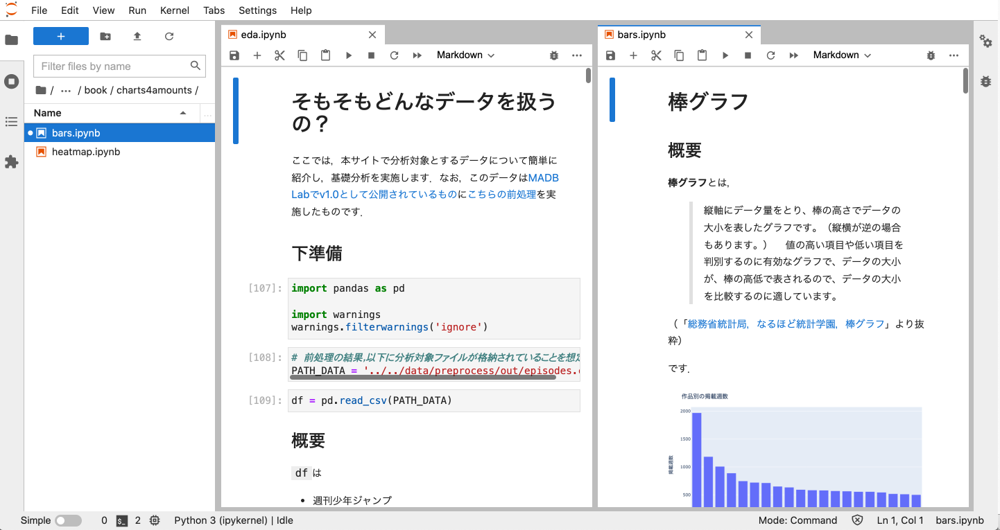

# はじめに

```{only} html
[](https://jupyterbook.org)
[](https://www.python.org/)
[](https://pandas.pydata.org/)
[](https://plotly.com/python/)
```

**データビジュアライゼーション**とは，数値や文章などのデータに基づいた情報を，人間が理解しやすい形に視覚化する技術を指します．

このサイトは，[文化庁の**メディア芸術データベース・ラボ**（**MADB Lab**）](https://mediag.bunka.go.jp/madb_lab/)で公開されている**四大少年誌**（
[週刊少年サンデー](https://websunday.net/)，
[週刊少年ジャンプ](https://www.shonenjump.com/j/)，
[週刊少年チャンピオン](https://www.akitashoten.co.jp/w-champion)，
[週刊少年マガジン](https://shonenmagazine.com/)
）のデータを用いて，データビジュアライゼーションの学習を手助けすることを目指しています．

:::{panels}
:container: +full-width
:column: col-lg-6 px-2 py-2
:card:

---
📚**約47年分の四大少年誌の掲載作品データを採用**📚
^^^
データビジュアライゼーションの学習において重要なのは，**分析対象のデータに興味を持てるかどうか**だと思います．
本サイトでは約47年の四大少年誌のマンガ作品データを採用しているため，モチベーションを保ちつつ学習を進めることが可能です．

<div style="text-align: center;">
<video autoplay loop muted playsinline width="100%" src="demo.mp4"></video>
</div>

---
👁️**Plotlyによるインタラクティブなビジュアライゼーション**👁️
^^^
Plotlyで自由にズームイン・ズームアウトが可能なグラフを出力しています．
興味の赴くまま，グリグリグラフを動かしてみましょう．
新たな分析のヒントが得られるかもしれません．

<div style="text-align: center;">
<video autoplay loop muted playsinline width="100%" src="plotly.mp4"></video>
</div>

---
👩‍🎓**Jupyter形式でPythonのソースコードを公開**🧑‍🎓
^^^

本サイトはJupyter Labで作成したソースコードをJupyter Bookでビルドして構築しています．
[GitHub](https://github.com/kakeami/viz-madb)からソースコードをダウンロードすることで，手元で環境を再現可能ですので，どんどん新しい切り口でビジュアライゼーションしましょう．
環境構築に関する詳細は[README.md](https://github.com/kakeami/viz-madb)をご参照ください．



---
🇯🇵**メディア芸術データベース・ラボ（MADB Lab）を利用**🇯🇵
^^^

MADB Labは，文化庁が提供する，メディア芸術作品に関するデータをより広く活用するためのウェブサイトです．
本サイトでは，[v1.0として公開されているデータ](https://github.com/mediaarts-db/dataset/tree/1.0)を[前処理](https://kakeami.github.io/viz-madb/appendix/preprocess.html)して利用しています．
データセットの詳細は[公式リポジトリ](https://github.com/mediaarts-db/dataset)をご参照ください．


:::

## こんなとき何を描く？

本サイトで紹介するビジュアライゼーション手法を，
[Claus O. Wilke, Fundamentals of Data Visualization](https://clauswilke.com/dataviz/index.html)を参考に分類しました．

:::{panels}
:container: +full-width
:column: col-lg-6 px-2 py-2

---
**量を見たい**
^^^

質的変数の量を見る最も一般的な方法は
[棒グラフ](https://kakeami.github.io/viz-madb/charts4amounts/bars.html)
を作図することです．
複数の質的変数を扱う場合は，集合棒グラフや積上げ棒グラフも効果的です．
前者は特に絶対値を比較したい場合，後者は特に割合を比較したい場合に便利です．
全体像を俯瞰したい場合は，
[ヒートマップ](https://kakeami.github.io/viz-madb/charts4amounts/heatmap.html)
を選択肢に入れましょう．
ただし，ヒートマップは質的変数の組合せの量を**色**で表現するため，数値を付記しなければ絶対値の比較が難しいことにご注意ください．

---
**分布を見たい**[^dist]
^^^

量的変数の分布を見る際に直感的にわかりやすいのは，
[ヒストグラム](https://kakeami.github.io/viz-madb/charts4dists/hist.html)
や
[密度プロット](https://kakeami.github.io/viz-madb/charts4dists/density.html)
ですが，パラメータ設定に注意が必要です．
複数の質的変数の分布を比較する際は，
[箱ひげ図](https://kakeami.github.io/viz-madb/charts4dists/box.html)，
[バイオリンプロット](https://kakeami.github.io/viz-madb/charts4dists/violin.html)，
そして
[ストリップチャート](https://kakeami.github.io/viz-madb/charts4dists/strip.html)
がおすすめです．
[リッジラインプロット](https://kakeami.github.io/viz-madb/charts4dists/ridgeline.html)
はバイオリンプロットと似ていますが，主に時間的に変動する大量の分布の変化を見る際に適しています．

---
**比率を見たい**
^^^

質的変数同士の比率を見る際は，
[円グラフ](https://kakeami.github.io/viz-madb/charts4props/pie.html)
や
[棒グラフ](https://kakeami.github.io/viz-madb/charts4props/bars.html)
が用いられます．
前者は割合を直感的に表現する際に適しており，後者は絶対値を比較する際に適しています．
連続的に変化する比率を表現する際は
[積上げ密度プロット](https://kakeami.github.io/viz-madb/charts4props/stacked_den.html)
が効果的です．
複数の質的変数の比率を表現する際は
[モザイクプロット](https://kakeami.github.io/viz-madb/charts4props/mosaic.html)，
[ツリーマップ](https://kakeami.github.io/viz-madb/charts4props/tree.html)，
そして
[パラレルセットグラフ](https://kakeami.github.io/viz-madb/charts4props/parallel.html)
を検討しましょう．
特に，モザイクプロットは二つの質的変数の組合せの比率を表現したいときに，
ツリーマップは階層構造を持つ質的変数の比率を表現したいときに，
そしてパラレルセットグラフは三つ以上の質的変数の比率を表現したいときに力を発揮します．

---
**変数間の関係を見たい**[^assoc]
^^^

二つの量的変数の関係を表現する典型的な方法は
[散布図](https://kakeami.github.io/viz-madb/charts4assocs/scatter.html)
を描くことです．
ただし，データ量が多すぎる場合は凡例が重複してわかりづらいので，
[二次元ヒストグラム](https://kakeami.github.io/viz-madb/charts4assocs/2d.html)
や
[等高線プロット](https://kakeami.github.io/viz-madb/charts4assocs/contours.html)
を検討しましょう．
量的変数が三つ以上ある場合は，
[バブルチャート](https://kakeami.github.io/viz-madb/charts4assocs/scatter.html)
や
[並行座標プロット](https://kakeami.github.io/viz-madb/charts4assocs/slope.html)
[^slope]でその関係性を表現できます．
変数同士の相関係数を表現したい場合は
[コレログラム](https://kakeami.github.io/viz-madb/charts4assocs/correlo.html)
を使いましょう．
ある変数の時系列的な変化を表現する際は
[折れ線グラフ](https://kakeami.github.io/viz-madb/charts4assocs/line.html)
を用いることが多いです．
なお一般的な折れ線グラフは一変数の推移しか表現できませんが，
[工夫](https://kakeami.github.io/viz-madb/charts4assocs/connected.html)
すれば二変数の推移を表現することも可能です．

:::

[^dist]: [Claus O. Wilke, Fundamentals of Data Visualization](https://clauswilke.com/dataviz/index.html)で分布を見る手法として紹介されているもののうち，次のものは割愛しました．**[Sina plot](https://www.tandfonline.com/doi/abs/10.1080/10618600.2017.1366914?journalCode=ucgs20)**：Plotlyで簡易に作図する方法が見当たらず，かつバイオリンプロットとストリップチャートで雰囲気をつかめると判断したため．**[Quantile-quantile plot](https://clauswilke.com/dataviz/ecdf-qq.html#qq-plots)**：理論的な確率密度分布と標本分布の一致性を見る目的で用いられることが多く，解釈に高度な数理統計学の知識が必要であり，本書のスコープを超えるため

[^assoc]: [Claus O. Wilke, Fundamentals of Data Visualization](https://clauswilke.com/dataviz/index.html)で分布を見る手法として紹介されているもののうち，次のものは割愛しました．**[Hexagonal binning](https://clauswilke.com/dataviz/overlapping-points.html#d-histograms)**：Plotlyで簡易に作図する方法が見当たらず，かつ二次元ヒストグラムで雰囲気をつかめると判断したため．

[^slope]: [Claus O. Wilke, Fundamentals of Data Visualization](https://clauswilke.com/dataviz/index.html)ではペアとなる二変数の関係性を示す手法として[Slopegraph](https://clauswilke.com/dataviz/visualizing-associations.html#associations-paired-data)が，ここでは三変数以上に対応可能であるという観点で紹介しました．

## 謝辞

- [Python](https://www.python.org/)
- [Pandas](https://pandas.pydata.org/)
- [Plotly](https://plotly.com/)
- [Jupyter](https://jupyter.org/)
- [Jupyter Book](https://jupyterbook.org/)
- [文部科学省文化庁，メディア芸術データベース・ラボ](https://mediag.bunka.go.jp/madb_lab/)
- [週刊少年サンデー](https://websunday.net/)
- [週刊少年ジャンプ](https://www.shonenjump.com/j/)
- [週刊少年チャンピオン](https://www.akitashoten.co.jp/w-champion)
- [週刊少年マガジン](https://shonenmagazine.com/)

## 参考文献

- [Claus O. Wilke, Fundamentals of Data Visualization](https://clauswilke.com/dataviz/index.html)
- [小久保 奈都弥，データ分析者のためのPythonデータビジュアライゼーション入門 コードと連動してわかる可視化手法](https://www.shoeisha.co.jp/book/detail/9784798163970)
- [総務省統計局，なるほど統計学園](https://www.stat.go.jp/naruhodo/)
- [岡崎 直観，機械学習帳](https://chokkan.github.io/mlnote/index.html)
